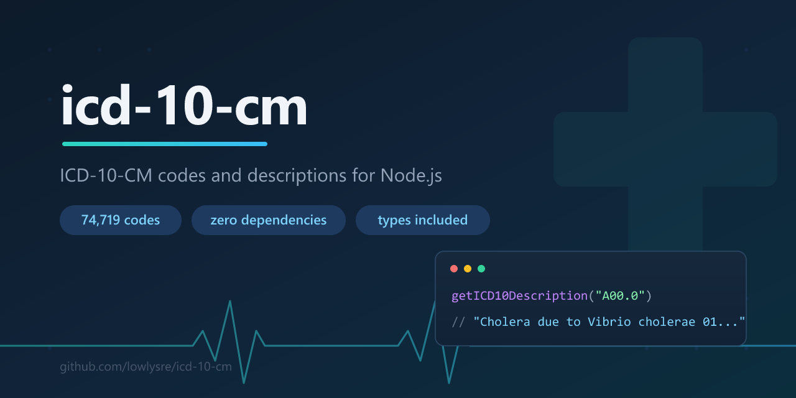

# icd-10-cm

<p align="center">
  
</p>

[](https://www.npmjs.com/package/@lowlysre/icd-10-cm)
[](https://npm-stat.com/charts.html?package=@lowlysre/icd-10-cm)
[](https://www.jsdelivr.com/package/npm/@lowlysre/icd-10-cm)
[](https://github.com/lowlysre/icd-10-cm/actions/workflows/test.yml)
[](https://github.com/lowlysre/sustainable-npm)

A data package containing the FY2027 ICD-10-CM diagnosis codes and descriptions (effective October 1, 2026), types included!

- ⚡ Fast, lookups via dictionary of minified json
- 🔒 Secure, a zero dependency package with provenance
- ⚛️ Small, limited to CM (Clinical Modification) data and less than 1MB compressed
- 🔏 Immutable, GitHub releases are locked and cannot be altered or replaced after publishing
- 🔌 Offline, the full code set ships inside the package: no API keys, no rate limits, and no calls to government servers at runtime. It runs inside closed-loop healthcare systems that block outbound traffic or require a vendor review for every external API

## Install

```shell
npm install @lowlysre/icd-10-cm
```

## Usage

```ts
import getICD10Description, { normalizeICD10Code } from "@lowlysre/icd-10-cm";

// Lookups normalize dots, casing, and whitespace automatically
const description = getICD10Description("A00.0");
// "Cholera due to Vibrio cholerae 01, biovar cholerae"

// Handle missing codes by checking for undefined
const maybeDescription = getICD10Description("Z999");
if (!maybeDescription) {
  // fallback logic here
}

// You can normalize a code explicitly if you store normalized keys elsewhere
const normalized = normalizeICD10Code(" a00.1 "); // "A001"
```

CommonJS works too:

```js
const { getICD10Description } = require("@lowlysre/icd-10-cm");
```

### Checking which release is bundled

`ICD10_CM_RELEASE` describes the code set shipped in the installed version, so an app can log it, show it, or fail fast when it expects a different year:

```ts
import { ICD10_CM_RELEASE } from "@lowlysre/icd-10-cm";

ICD10_CM_RELEASE.fiscalYear; // 2027
ICD10_CM_RELEASE.effectiveDate; // "2026-10-01"
ICD10_CM_RELEASE.codeCount; // 74879
```

### Using with AI

- Grounding AI output. Language models describe ICD-10-CM codes from memory, so they get laterality and severity wrong and invent descriptions for codes that don't exist. Check each model-produced code against the official set before showing or storing it.
- Agent tools. Expose `getICD10Description` as a tool or function call, so an agent reads the official description instead of recalling one.

```ts
import { getICD10Description } from "@lowlysre/icd-10-cm";

const modelCodes = ["E11.9", "H40.1131", "E11.99"];

const checked = modelCodes.map((code) => ({
  code,
  description: getICD10Description(code) ?? null,
}));
// [
//   { code: "E11.9", description: "Type 2 diabetes mellitus without complications" },
//   { code: "H40.1131", description: "Primary open-angle glaucoma, bilateral, mild stage" },
//   { code: "E11.99", description: null }, // not a real code
// ]
```

## API

- `getICD10Description(code)` (also the default export) returns the description for a code, or `undefined` when the code isn't in the bundled release. Input is normalized first.
- `normalizeICD10Code(code)` trims whitespace, strips dots, and uppercases, matching the dataset keys.
- `ICD10_CM_RELEASE` is a frozen object with the bundled release's `fiscalYear`, `effectiveDate`, and `codeCount`.
- `ensureICD10DatasetLoaded(data)` returns `data`, or throws when it's empty or missing.
- Types: `ICD10Dictionary`, `ICD10CMRelease`.

The package supports Node.js 22 or later.

## Raw data via CDN

The dataset is a flat JSON object of normalized code to description. Browsers and other runtimes can fetch it straight from jsDelivr without installing anything:

```js
const res = await fetch(
  "https://cdn.jsdelivr.net/npm/@lowlysre/icd-10-cm@3/data/icd10.min.json",
);
const codes = await res.json();
codes["A000"]; // "Cholera due to Vibrio cholerae 01, biovar cholerae"
```

Pin the major version in the URL so the code set only changes when you choose to upgrade.

## Versioning

Each new ICD-10-CM release (the annual October 1 update, and any April 1 update) ships as a new major version. A release can delete or redefine codes, so a caret range like `^3.0.0` never silently changes the code set underneath an app. Upgrade the major version deliberately to pick up a new year.

Minor and patch versions contain code and tooling changes only; the data stays the same.

## Data Source

ICD-10-CM is maintained by the CDC's National Center for Health Statistics (NCHS), which publishes the code files for free public use: [ICD-10-CM files](https://www.cdc.gov/nchs/icd/icd-10-cm/files.html). The MIT license covers this package's code.

This package is not affiliated with or endorsed by the CDC, NCHS, or CMS.

## Contributing

See [CONTRIBUTING.md](.github/CONTRIBUTING.md) for setup and the yearly data update steps.

## Versions

- v3.1.1 - README AI use cases (output grounding, agent tools), closed-loop offline use, `ai`, `llm`, and `offline` npm keywords
- v3.1.0 - `ICD10_CM_RELEASE` export with the bundled fiscal year, effective date, and code count. Node.js 22+ declared in `engines`, `package.json` exported, expanded npm keywords. API, CDN, and versioning docs, plus contributing and security guides
- v3.0.0 - Data updated to the October 1, 2026 ICD-10-CM release (74,879 codes, from the FY2027 set)
- v2.0.0 - Data updated to the April 1, 2026 ICD-10-CM release (74,719 codes, from the FY2024 set). TypeScript 7 (native compiler) toolchain, ESLint replaced with oxlint + Prettier, dropped tsup for plain tsc (zero-bundler dual ESM/CJS), dataset shipped once and lazy-loaded (~50% smaller install, faster imports), fixed broken `require()` entry point
- v1.1.5 - Dependency and toolchain maintenance
- v1.1.0 - Migrated tests from Jest to Node's built-in test runner, TypeScript 6 toolchain
- v1.0.3 - Dependency maintenance, CODEOWNERS
- v1.0.1 - README badges, sustainable-npm publishing workflow
- v1.0.0 - Normalized lookups, data load guard, bundled ESM/CJS build, flat ESLint 9 config, 100% tests/coverage
- v0.0.x - Initial releases, April 1, 2024 ICD-10-CM update
